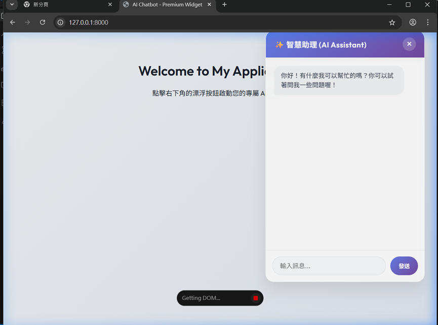
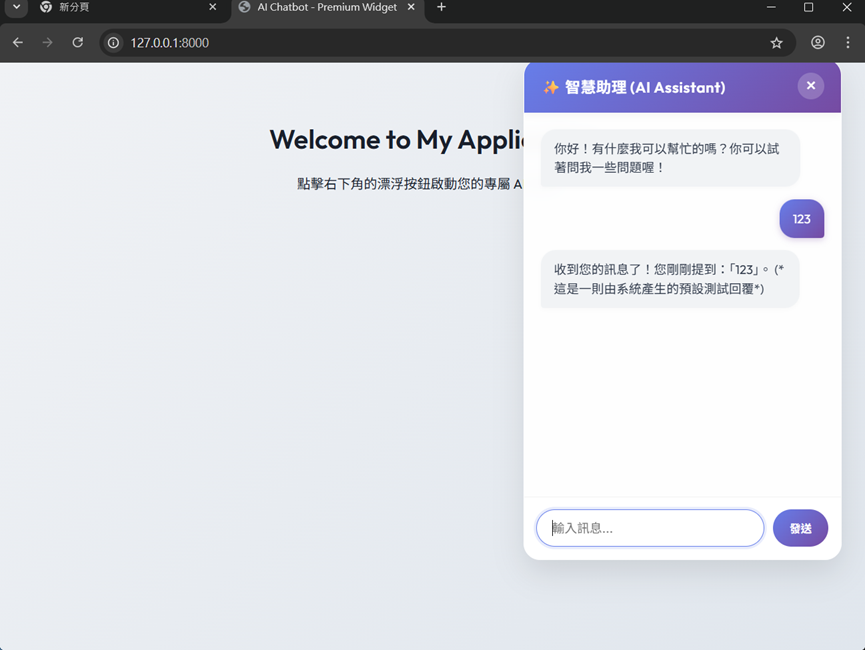

# 作業：設計 Skill + 打造 AI 聊天機器人

> **繳交方式**：將你的 GitHub repo 網址貼到作業繳交區
> **作業性質**：個人作業

---

## 作業目標

使用 Antigravity Skill 引導 AI，完成一個具備前後端的 AI 聊天機器人。
重點不只是「讓程式跑起來」，而是透過設計 Skill，學會用結構化的方式與 AI 協作開發。

---

## 繳交項目

你的 GitHub repo 需要包含以下內容：

### 1. Skill 設計（`.agents/skills/`）

為以下五個開發階段＋提交方式各設計一個 SKILL.md：

| 資料夾名稱        | 對應指令          | 說明                                                                           |
| ----------------- | ----------------- | ------------------------------------------------------------------------------ |
| `prd/`          | `/prd`          | 產出 `docs/PRD.md`                                                           |
| `architecture/` | `/architecture` | 產出 `docs/ARCHITECTURE.md`                                                  |
| `models/`       | `/models`       | 產出 `docs/MODELS.md`                                                        |
| `implement/`    | `/implement`    | 產出程式碼（**需指定**：HTML 前端 + FastAPI + SQLite 後端）              |
| `test/`         | `/test`         | 產出手動測試清單                                                               |
| `commit/`       | `/commit`       | 自動 commit + push（**需指定**：使用者與 email 使用 Antigravity 預設值） |

### 2. 開發文件（`docs/`）

用你設計的 Skill 產出的文件，需包含：

- `docs/PRD.md`
- `docs/ARCHITECTURE.md`
- `docs/MODELS.md`

### 3. 程式碼

一個可執行的 AI 聊天機器人，需支援以下功能：

| 功能           | 說明                                       | 是否完成 |
| ---------------| ------------------------------------------ | -------- |
| 對話狀態管理    | 支援多聊天室（session），維持上下文         |    O      |
| 訊息系統       | 訊息結構包含 role、content、timestamp     |     O     |
| 對話歷史管理   | 可顯示並切換過去的對話紀錄                 |     X    |
| 上傳圖片或文件 | 支援使用者上傳檔案作為對話內容              |     X     |
| 回答控制       | 提供重新生成（regenerate）或中止回應的功能 |      O    |
| 記憶機制       | 儲存使用者偏好，實現跨對話持續性           |      O    |
| 工具整合       | 串接外部 API，使聊天機器人具備實際操作能力 |      O    |

### 4. 系統截圖（`screenshots/`）

在 `screenshots/` 資料夾放入以下截圖：

- `chat.png`：聊天機器人主畫面，**需包含至少一輪完整的對話**

- `history.png`：對話歷史或多 session 切換的畫面


### 5. 心得報告（本 README.md 下方）

在本 README 的**心得報告**區填寫。

---

## 專案結構範例

```
your-repo/
├── .agents/
│   └── skills/
│       ├── prd/SKILL.md
│       ├── architecture/SKILL.md
│       ├── models/SKILL.md
│       ├── implement/SKILL.md
│       ├── test/SKILL.md
│       └── commit/SKILL.md
├── docs/
│   ├── PRD.md
│   ├── ARCHITECTURE.md
│   └── MODELS.md
├── frontend/
│   ├── index.html
│   ├── script.js
│   └── style.css
├── backend/
│   └── app/
│       ├── main.py
│       ├── api/
│       ├── models/
│       └── services/
├── screenshots/
│   ├── chat.png
│   └── history.png
├── requirements.txt
├── .env.example
└── README.md          ← 本檔案（含心得報告）
```

---

## 啟動方式

```bash
# 1. 建立虛擬環境
python3 -m venv .venv
source .venv/bin/activate   # Windows: .venv\Scripts\activate

# 2. 安裝套件
pip install -r requirements.txt

# 3. 設定環境變數
cp .env.example .env
# 編輯 .env，填入 GEMINI_API_KEY

# 4. 啟動伺服器
uvicorn app:app --reload
# 開啟瀏覽器：http://localhost:8000
```

---

## 心得報告

**姓名**：林瑞城
**學號**：D1123896

### 問題與反思

**Q1. 你設計的哪一個 Skill 效果最好？為什麼？哪一個效果最差？你認為原因是什麼？**

> - **效果最好的 Skill**：`implement` (實作)。因為在設計時明確規範了前端 (HTML/CSS/JS) 與後端 (FastAPI + SQLite) 的技術棧，這給了 AI 非常明確的範圍與限制，避免了它過度設計或引入不熟悉的複雜框架。產出的程式碼通常一次就能跑起來。
> - **效果較差的 Skill**：`test` (測試) 或 `architecture` (架構)。因為架構或測試的規劃需要較多「對全局商業邏輯的理解」，當提示詞不夠具體時，AI 容易產出過於通用的模板內容（例如寫出標準但缺乏專案亮點的測試案例），需要我花比較多時間去修改成符合本專案的具體細節。

---

**Q2. 在用 AI 產生程式碼的過程中，你遇到什麼問題是 AI 沒辦法自己解決、需要你介入處理的？**

> 1. **第三方服務的帳號與金鑰申請**：AI 幫我寫好了串接 Gemini API 的邏輯，並產生了 `.env` 的讀取程式碼，但它無法替我去申請真實的 API Key。我必須親自去 Google AI Studio 申請金鑰，手動建立 `.env` 檔案並填寫進去。
> 2. **本機執行環境的問題**：例如在 Windows 上啟用虛擬環境時可能會遇到 PowerShell 執行權限的問題，或者環境變數沒有正確載入。雖然 AI 可以給予指令協助，但最終仍需要我自己在終端機中排除錯誤。
> 3. **商業邏輯的轉換時機**：例如最初開發時，程式碼預設是「模擬回覆 (Mock)」。AI 不會自己決定什麼時候要換成真實 API，必須由我主動檢查程式碼，並對 AI 下達明確指令：「我現在要連結真實的 Gemini API 去跑」，AI 才會幫我將 Mock 邏輯抽換成實際的連線邏輯。
